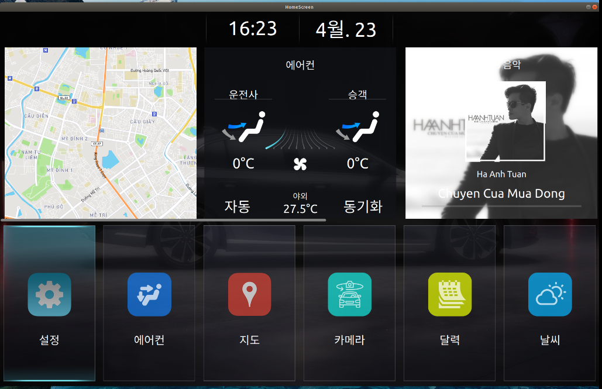

# PROJECT: HOME APPLICATION 

Dự án mô phỏng ứng dụng Home thực tế ở mức đơn giản trên màn hình người lái trong ô tô.

### Thông tin về source code:

- Viết bằng ngôn ngữ C++, Qt/QML 
- Build trên hệ điều hành Linux (Ubuntu 18.04.6) và Qt

### Project bao gồm các kiến thức đã sử dụng như:

- Lập trình hướng đối tượng
- Lập trình trên framework Qt và QML
- Làm việc với QMediaPlayer, QMediaPlaylist, QTranslation, QDocDocument, QLocale, QDate, QTime.
- Thay đổi thứ tự các App và cập nhật thứ tự ở các App trong QAstractListModel
- Làm việc với IPC: DBus để truyển nhận dữ liệu trong Climate Application

## Cấu trúc chương trình: 
- UI: Sử dụng mô hình MVC để thiết kế UI

- Backend C++: Ứng dụng được xử lí tương tác thông qua các lớp ở C++ và được thể hiện mối quan hệ như sau: 

## Chức năng:
- Hiển thị thông tin ngày và giờ
- Hiển thị thông tin của app lên các Widget
- Mở các ứng dụng thông qua click và shortcut
- Điều khiển focus qua các widget và app
- Map app: hiển thị bản đồ
- Climate app: giao tiếp với DBus để lấy dữ liệu từ Climate Simulator
- Media app: hiển thị danh sách nhạc và phát nhạc
- Settings app: thay đổi ngôn ngữ cho toàn bộ hệ thống và điều chỉnh âm thanh hệ thống 

### 1. Hiển thị thông tin ngày và giờ:
- Nếu có thông tin thì thực hiện đọc file và đưa dữ liệu vào chương trình để thực hiện cập nhật và hiển thị dữ liệu theo các chức năng:

### 2. Hiển thị thông tin của app lên các Widget:
- Các ứng dụng Map, Climate và Media được mở trong Home sẽ được hiển thị thông tin trên Widget để user có thể theo dõi hoạt động của ứng dụng 

### 3. Mở các ứng dụng thông qua click và shortcut:
- Ứng dụng Home có các ứng dụng cần thiết như Climate, Settings, Media,... và ta có thể mở nó bằng cách click chuột hoặc bằng shortcut trên bàn phím
    
* Tính năng thể hiện trong tài liệu UX

### 4. Điều khiển focus qua các widget và app bằng hard key:
- Focus là sự thể hiện qua click ứng dụng hoặc thao tác bàn phím để mở ứng dụng đó. 

* Tính năng thể hiện trong tài liệu UX

### 5. Climate app: giao tiếp với DBus để lấy dữ liệu từ Climate Simulator

- Climate Simulator App:

- Dữ liệu điều hòa của Climate Simulator App sẽ được emit lên DBus và Climate App sẽ nhận được dữ liệu của Climate Simulator qua DBus.

### 6. Media App - hiển thị danh sách nhạc và phát nhạc: 
- Media App là một ứng dụng phát nhạc có các tính năng cơ bản: phát nhạc, lặp lại bài hát, phát ngẫu nhiên và lựa chọn bài hát.
  

### 7. Settings app - thay đổi ngôn ngữ cho toàn bộ hệ thống: 

- Lựa chọn ngôn ngữ muốn hiển thị:
  

- Tiếng Việt: Các text ở Home, ngày tháng hiển thị và các App khác sẽ hiển thị bằng tiếng Việt

- Tiếng Hàn: Các text ở Home, ngày tháng hiển thị và các App khác sẽ hiển thị bằng tiếng Hàn

- Tiếng Nhật: Các text ở Home, ngày tháng hiển thị và các App khác sẽ hiển thị bằng tiếng Nhật

